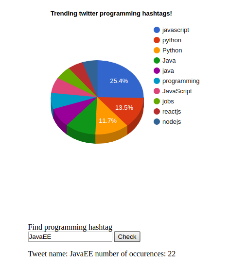

# Server-sent events with flask
#### Simple test of server-sent events with Flask and Twitter API
## Start
Fill **config.cfg.template** with your Twitter API keys and change name to **config.cfg** 
```
docker-compose up -d
```
## Stop
```
docker-compose stop
```
## Results

### http://localhost:5000



